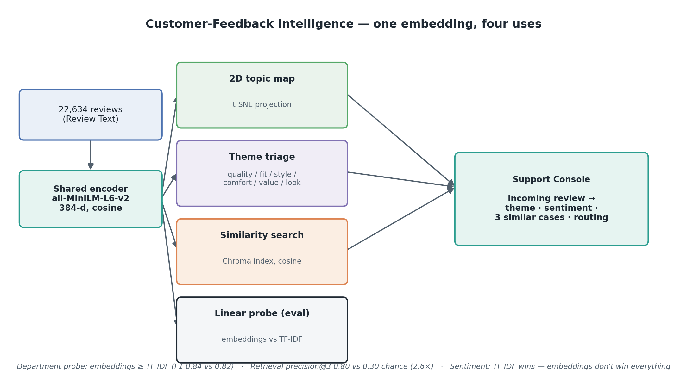
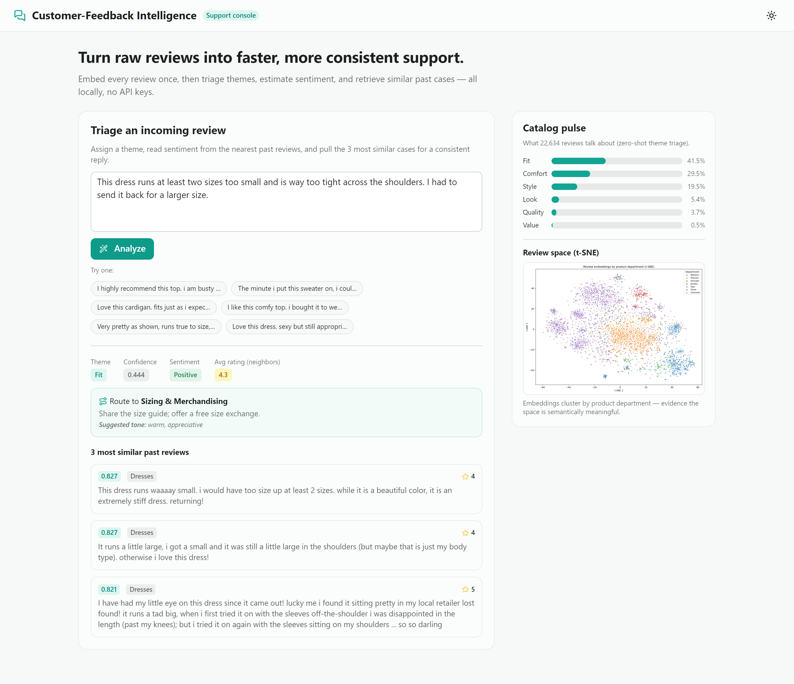
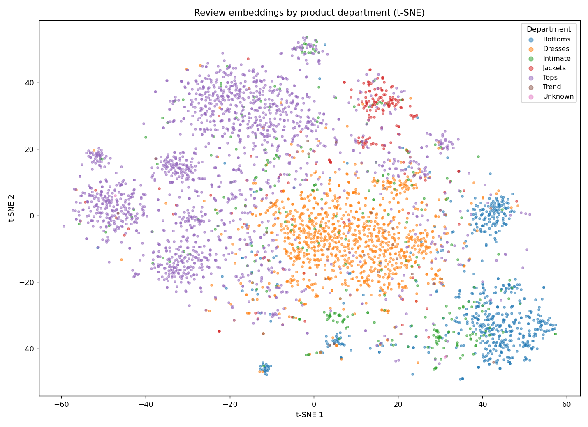

# Customer-Feedback Intelligence

[](https://github.com/buzinarov/ia-projects/actions/workflows/ci.yml)
[](../LICENSE)


Turning **22,634 free-text clothing reviews** into something a support agent and
a merchandiser can act on: a 2D map of what customers talk about, zero-shot
**theme triage**, a **sentiment read**, and **similar-review retrieval** — all
from a single shared embedding, computed locally with no API keys. It is framed
the way a real initiative would be: three personas, an acceptance bar fixed
before any numbers existed, and an explicit honesty boundary about what these
embeddings can and cannot prove.

**The short version:** embeddings are a clear win where *semantics* matter —
they edge out a TF-IDF baseline on product-area classification (weighted-F1
**0.82 → 0.84**) and crush random chance on retrieval (precision@3 **0.30 →
0.80**, a **2.6×** lift). But they are *not* a free lunch: on short-text binary
sentiment, plain bag-of-words **beats** them (0.88 → 0.85). Saying so is the
point — the baseline is there to be able to win.

> This project reproduces, and then productizes, the DataCamp exercise *"Topic
> Analysis of Clothing Reviews with Embeddings"*. The four briefed deliverables
> (embeddings, a 2D visualization, feedback categorization, similarity search)
> are delivered end-to-end in [`notebooks/02_topic_analysis.ipynb`](notebooks/02_topic_analysis.ipynb);
> the full kickoff contract is in [`docs/requirement.md`](docs/requirement.md).



## Personas

The scope reflects an agreement between three roles, not one function's wish list.

| Persona | Owns | Cares most about |
|---|---|---|
| **Customer Support Lead** | Reply quality and speed | Triage an incoming review to a theme, read its sentiment, see similar past cases for a consistent reply |
| **Merchandising / PM** | Product & catalog decisions | An honest read of what customers talk about |
| **Senior AI Engineer** | Pipeline, evaluation rigor, the honesty boundary | Defensible metrics, an honest baseline, one set of vectors for eval *and* product, no keys in a public repo |

## Objective & the honesty boundary

**The scenario.** A women's-clothing retailer has tens of thousands of reviews
and no structured way to use them. Support answers each one from scratch;
merchandising has no quick read on recurring themes. Turn the raw `Review Text`
into a triage-and-retrieval tool — *without* first standing up a labeling effort.

**The honesty boundary.** The themes (quality / fit / style / comfort / value /
look) have **no ground-truth labels** in this dataset. So:

- **Theme assignment is an unsupervised triage aid, not a measured classifier.**
  There is no "theme accuracy" here, and none is invented.
- **What we measure instead** is whether the *embedding space* is meaningful,
  using the labels the data actually has — `Recommended IND` (sentiment) and
  `Department Name` (product area) — via a linear probe against a **TF-IDF
  baseline**, plus a retrieval proxy against random chance.

**The acceptance bar**, fixed in the kickoff: embeddings must (1) at least
*match* TF-IDF on department under a linear probe, and (2) retrieve
same-department neighbors at **≥ 2× chance**. Beating TF-IDF on sentiment was
deliberately *not* promised — bag-of-words is strong there.

## The Data

[Women's E-Commerce Clothing Reviews](https://www.kaggle.com/datasets/nicapotato/womens-ecommerce-clothing-reviews)
— 23,486 anonymized real reviews. Downloaded on first use from a public mirror
and cached under `data/` (gitignored); nothing is committed and no Kaggle auth is
needed. After dropping empty texts and exact duplicates, **22,634** reviews
remain. Only `Review Text` is used as input; the other columns are evaluation
labels, never product features.

## Methodology

### One shared encoder

Every component embeds text with the **same** model — sentence-transformers
`all-MiniLM-L6-v2` (384-dim, L2-normalized so cosine is a dot product),
`src/embeddings.py`. The t-SNE map, the theme triage, the linear probe, and the
live Chroma search all read the *same* vectors, so "the numbers" and "the
product" can never measure similarity differently.

### Zero-shot theme triage

Each theme is described by a few anchor phrases; a review is assigned to the
theme whose **best-matching anchor** is closest by cosine (max-over-anchors, not
an averaged centroid — averaging lets two broad themes absorb everything).

> *Reference-code note:* the original DataCamp snippet selects the theme with
> `min(..., key=lambda x: x["index"])`, which always returns the first theme
> regardless of distance. The correct selection — nearest anchor — is used here.

### The measurable core — `src/evaluate.py`

- **Linear probe.** Freeze the embeddings, fit a plain logistic regression to a
  held-out label, and compare against TF-IDF (1–2 grams) through the *identical*
  classifier and split. If a linear model reads the label off the vectors, the
  geometry already encodes it.
- **Retrieval proxy.** For 2,000 sampled reviews, do the 3 nearest neighbors
  share the query's department more than a random review would?

## The app — a working Support Console

A single-page Reflex app puts the pipeline in front of a support agent: paste an
incoming review and get its **theme**, a **sentiment** estimate (the majority
recommend-vote among its nearest past reviews), the **3 most similar past
reviews**, and a **routing suggestion** — alongside a catalog-pulse view of what
customers talk about. No LLM: the routing/tone line is a transparent rule on the
assigned theme and retrieved sentiment, so it runs anywhere.



```bash
cd app && python -m reflex run     # serves the console at http://localhost:3000
```

## Architecture

A single pass — reviews → one embedding matrix → four uses → the console:

- `src/embeddings.py` — the one shared encoder (MiniLM, cosine), with an on-disk cache.
- `src/themes.py` — zero-shot theme anchors + nearest-anchor assignment.
- `src/reduce.py` — t-SNE projection + the topic-map plots.
- `src/rag.py` — a persistent **Chroma** index built from the same vectors; `find_similar_reviews()`.
- `src/evaluate.py` — the linear probe (vs TF-IDF) and the retrieval proxy.
- `src/run_all.py` — the end-to-end pipeline that regenerates every artifact.

```
src/
  data.py        download + clean + cache the reviews (only `Review Text` is input)
  embeddings.py  shared sentence-encoder (all-MiniLM-L6-v2, cosine) + disk cache
  themes.py      zero-shot theme anchors + max-over-anchors assignment
  reduce.py      t-SNE -> 2D + topic-map plots
  rag.py         Chroma index over reviews (cosine) + find_similar_reviews()
  evaluate.py    linear probe (embeddings vs TF-IDF) + retrieval proxy
  run_all.py     full pipeline -> all artifacts
notebooks/
  01_eda.ipynb            the data: ratings, departments, length (Descriptive)
  02_topic_analysis.ipynb the four briefed deliverables, executed end to end
tests/           pytest: theme logic, probe/retrieval math, data + index, regression bounds
artifacts/       metrics_summary.json, theme_distribution.json, topic maps, most_similar_reviews.json
docs/            requirement.md, the pipeline diagram, the app screenshot
app/app/         the Reflex Support Console (console.py + support_service.py)
```

**Running it:**

```bash
pip install -r requirements.txt

python -m src.run_all        # data -> embeddings -> themes -> 2D map -> index -> eval
python -m src.evaluate       # just the probe + retrieval proxy -> artifacts/metrics_summary.json
pytest                       # pure-logic tests always run; model/index tests skip if absent
```

## Results

### Linear probe — embeddings vs. a TF-IDF baseline

Frozen features → logistic regression, same split (25% test), over 22,634 reviews.

| Label | Features | Accuracy | Weighted-F1 |
|---|---|---|---|
| **Department** (6-class, majority 0.44) | TF-IDF baseline | 0.839 | 0.821 |
| | **Embeddings** | **0.850** | **0.840** |
| **Recommended** (binary, majority 0.82) | **TF-IDF baseline** | **0.891** | **0.880** |
| | Embeddings | 0.863 | 0.850 |

### Retrieval proxy

| Metric | Embeddings | Random chance | Lift |
|---|---|---|---|
| **precision@3** (same department) | **0.80** | 0.30 | **2.6×** |

**Three honest reads:**

- **Embeddings clear the bar.** They match-and-beat TF-IDF on the *semantic*
  label (department) and recover same-department neighbors at 2.6× chance — both
  acceptance criteria met.
- **They lose on sentiment, and that's the interesting result.** For short,
  sentiment-laden reviews, a TF-IDF bag-of-words is a strong, hard-to-beat
  baseline; the embeddings trail it by ~3 points. Embeddings win on *meaning*
  and *retrieval*, not on everything — exactly why the baseline exists.
- **Themes are a lens, not a metric.** The triage distribution (below) is
  dominated by **Fit** and **Comfort**, which matches domain intuition for
  clothing reviews — but it is an unsupervised aid, deliberately left unscored.

### What customers talk about (theme triage)

| Fit | Comfort | Style | Look | Quality | Value |
|---|---|---|---|---|---|
| 9,382 | 6,672 | 4,404 | 1,213 | 844 | 119 |

The 2D map shows the same embeddings cluster cleanly by product department —
visual evidence the space is semantically meaningful:



### The brief's worked example

`find_similar_reviews("Absolutely wonderful - silky and sexy and comfortable")`:

```text
1. Absolutely wonderful - silky and sexy and comfortable      (the query itself)
2. Very comfortable, flattering, washes nicely- love it!
3. Wonderful and comfortable dress, very sweet.
```

## Limitations & next steps

- **No theme ground truth.** The headline limitation, stated up front: theme
  triage is unscored by design. Validating it would need a labeled sample (even a
  few hundred hand-tagged reviews would let us report a real macro-F1).
- **Sentiment.** Since TF-IDF wins on sentiment here, a shipped sentiment signal
  should use it (or a fine-tuned encoder) rather than off-the-shelf embeddings.
- **Retrieval scale.** The Chroma index holds all 22.6k reviews on one machine;
  a production deployment would need an ANN service and freshness handling.
- **t-SNE is illustrative.** The 2D map is a random 4k-review sample for
  legibility; it drives intuition, not decisions.

## Deliverables map (the DataCamp brief)

| Brief deliverable | Where |
|---|---|
| Create & store `embeddings` | `src/embeddings.py`, notebook §1 |
| `embeddings_2d` + 2D plot | `src/reduce.py`, notebook §2 |
| Feedback categorization | `src/themes.py`, notebook §3 |
| `find_similar_reviews` + `most_similar_reviews` | `src/rag.py`, notebook §4 |
