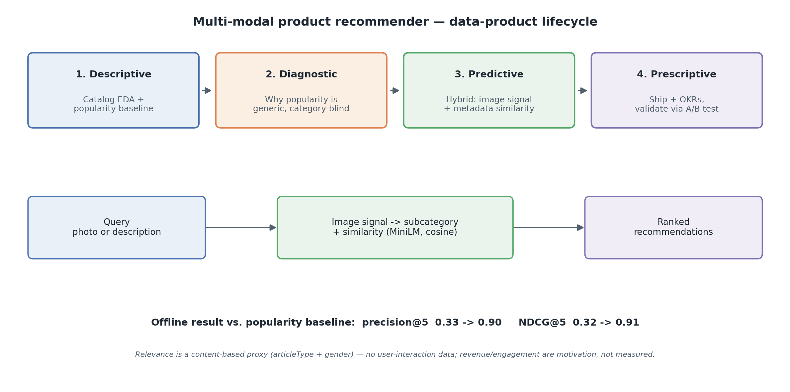
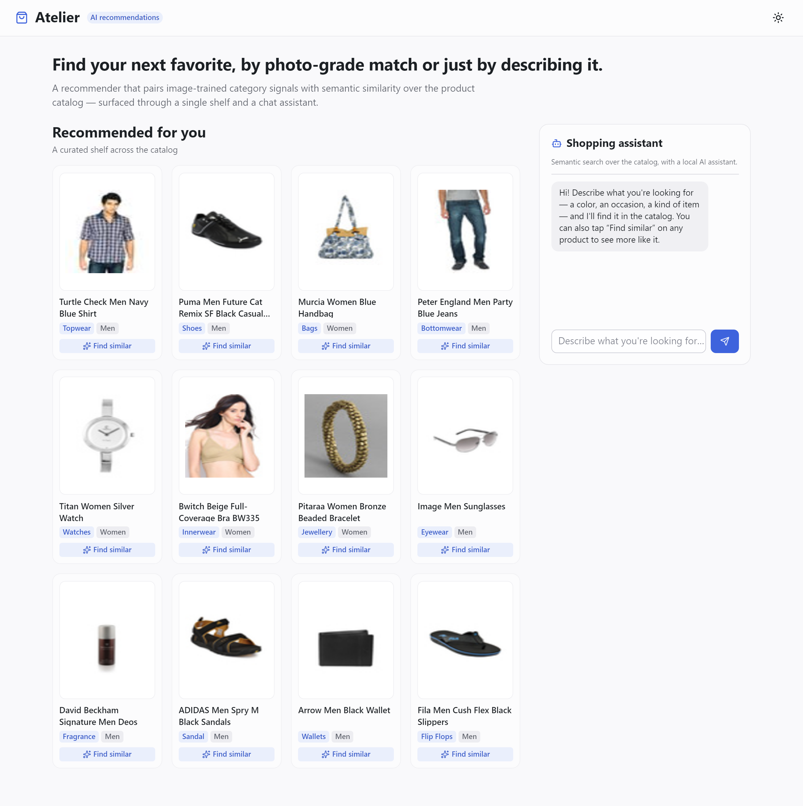
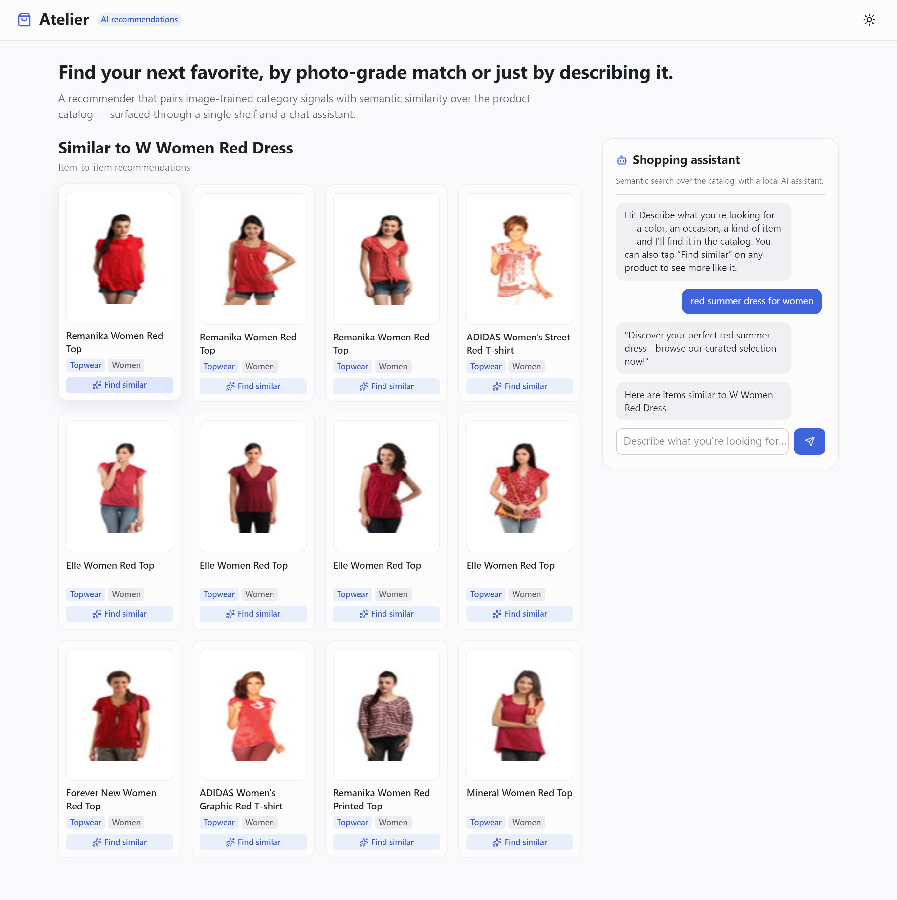
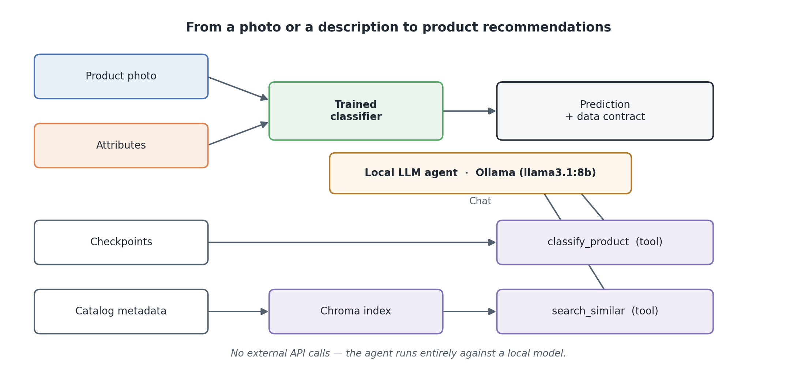

# Multi-Modal Product Recommender

[](https://github.com/buzinarov/ia-projects/actions/workflows/ci.yml)
[](../LICENSE)


A data-product case study: replacing a naive *suggested-product* recommender
with a multi-modal one that combines an **image-classification signal** with a
**metadata-similarity signal**, reachable either by attaching a product photo or
by describing the item to a local AI agent. It is framed and evaluated the way a
real initiative would be — three collaborating personas, a baseline to beat, a
fixed acceptance bar set before any numbers existed, and an honesty boundary
about what this dataset can and cannot prove.

**In short:** the proposed hybrid beats the popularity baseline by a clear,
defensible margin on offline ranking metrics (precision@5 **0.33 → 0.90**,
NDCG@5 **0.32 → 0.91**). The improvement is deliberately not presented as a
revenue lift: this catalog has no user-interaction data, so revenue and
engagement serve as the motivation for the work rather than as measured outcomes
— a distinction the project keeps throughout.

> The full kickoff contract — scenario, personas, success criteria — lives in
> [`docs/requirement.md`](docs/requirement.md).



## The four pillars of the data-product lifecycle

The work is framed against the standard Descriptive → Diagnostic → Predictive →
Prescriptive lifecycle, so it is a product with a rationale and a recommended
action, not just a model:

| Pillar | Question | In this product |
|---|---|---|
| **Descriptive** — *where we are* | What do the catalog and the baseline look like? | Catalog EDA (`notebooks/01_eda.ipynb`); the popularity-by-category baseline |
| **Diagnostic** — *why we are there* | Why do the baseline's suggestions underperform? | It ranks by category popularity alone — category-correct, but blind to the specific item |
| **Predictive** — *what is going to happen* | What will the new model recommend? | The hybrid recommender (image classification + metadata similarity, via the agent) |
| **Prescriptive** — *what we should do* | What action follows? | A ship/no-ship recommendation and the OKRs it implies |

## Personas

The requirement reflects agreements between three roles, not one function's wish list.

| Persona | Owns | Cares most about |
|---|---|---|
| **Product Manager** | Scope, success criteria, sequencing | A measurable, shippable improvement and a clear "done" |
| **Commercial Stakeholder** | The business case for the suggested-product feature | Revenue and engagement on the recommendation surface |
| **Senior AI Engineer** | Model design, evaluation rigor, the data contract | Defensible metrics, honest baselines, reproducibility |

## Objective

**The scenario.** The storefront runs a *suggested-product* feature powered by a
**simple recommender already in production**: it surfaces the most popular items
within a product category (popularity-by-category — common as a first system
because it is trivial to ship and needs no training). The **Commercial
Stakeholder** finds its suggestions generic and category-obvious, and the
revenue/engagement KPIs on that surface are flat. They convened the **Product
Manager** and the **Senior AI Engineer** to agree on a replacement, developed
with an AI assistant in the loop.

**The honesty boundary.** Revenue and engagement are the *motivation* for this
initiative — not a measured outcome. This dataset is a **static catalog** with
**no user-interaction data** (no clicks, purchases, sessions, or ratings), so a
revenue or engagement lift cannot be measured honestly, and fabricating synthetic
interactions to claim one would be misleading. The boundary is therefore explicit:

- **Motivation (narrative only):** revenue and engagement.
- **Measured success (only from existing data):** offline ranking quality —
  **precision@k, recall@k, NDCG@k** — against a content-based relevance *proxy*,
  labeled as a proxy wherever it appears.

**The acceptance bar**, fixed in the kickoff before any numbers existed: the new
model must beat the popularity baseline on those offline metrics.

## The Data

[Fashion Product Images (Small)](https://www.kaggle.com/datasets/paramaggarwal/fashion-product-images-small),
via the public Hugging Face mirror [`ashraq/fashion-product-images-small`](https://huggingface.co/datasets/ashraq/fashion-product-images-small)
— public, no auth, loads straight through the `datasets` library.

- **44,072 product photos** with structured metadata.
- **Image:** resized to 80×80 RGB (the EDA notebook walks through why).
- **Metadata (the similarity signal's source):** `productDisplayName`,
  `articleType`, `subCategory`, `gender`, `baseColour`, `season`, `usage`.
- After dropping subcategories under 100 samples, the catalog spans **27 subcategories**.

## Methodology

### Two recommenders, one honest comparison

- **Baseline — popularity-by-category** (`PopularityRecommender`). Within the
  query item's subcategory, it returns items of the most popular article types
  in the catalog. Category-correct by construction, but identical for every
  query in a category — the "generic" behavior the stakeholder complains about.
- **Proposed — hybrid** (`HybridRecommender`). Ranks by **metadata similarity**
  — sentence-transformers embeddings (`all-MiniLM-L6-v2`, cosine) over the
  product's natural-language text — then boosts candidates that match the query's
  **predicted category** (the image-classification signal) and its **gender**.
  The *same* embedding model backs both the offline evaluation and the live
  Chroma index (`src/embeddings.py`), so the numbers and the served system
  measure similarity identically. The category signal is injectable, so the live
  app supplies the image model's prediction while the offline evaluation supplies
  the ground-truth category — isolating retrieval quality from classifier error
  (the image classifier's own accuracy is ~93%).

### Two interaction modes: text and photo

The recommender accepts a query as free text or as a product photo. Both paths
are implemented and demonstrated end to end by a local tool-calling agent
(Ollama, on-device — no external API, no keys to manage) in
[`notebooks/02_case_study.ipynb`](notebooks/02_case_study.ipynb): it calls
`search_similar_products` for a description, or `classify_product` followed by a
category-scoped `search_similar_products` for a photo.

The live storefront takes a narrower, deliberate path: its chat calls the
retrieval signal directly instead of routing through the LLM. Early testing
showed the small local model would occasionally narrate invented product names
alongside the real results — fine in a notebook demo, not acceptable on a
product surface. The storefront keeps the LLM out of the response path
entirely, so what it shows is always exactly what retrieval returned. The
trade-off is explicit: the agent's tool-calling architecture is the more
general design, proven in the notebook; the storefront ships the narrower,
hallucination-free path for the surface end users actually touch.

### The relevance proxy — and its honest limitation

With no interaction data, relevance is a **content-based proxy** built only from
existing columns: an item is relevant to a query when it shares the query's
**`articleType` and `gender`**. This is *finer* than the subcategory the
baseline groups by — which is what makes the comparison meaningful (the baseline
gets the category right but the specific item wrong). Two deliberate choices
keep the proxy honest:

- The fields that *define* relevance (`articleType`, `gender`) are **excluded
  from the indexed similarity text**, so the retriever can't read the answer off
  a verbatim categorical token; it must recover relevance from the natural
  product name and the remaining attributes.
- The proxy measures whether the model recovers fine-grained catalog structure
  the baseline ignores — **not** real user preference. That caveat travels with
  every number below.

## The app — a working storefront

A single-page Reflex storefront puts the recommender in front of a user the way
a real *suggested-product* surface would: a recommended-products shelf alongside
an AI shopping assistant. Every product on screen is a real catalog item shown
with its own photo; nothing is generated.



Two market-standard recommendation patterns drive it:

- **Describe it** — semantic text search. The assistant embeds the request,
  cosine-ranks the catalog, and replies with a concrete summary of what it found.
  The recommendations come straight from retrieval and are shown as cards, so the
  results are always grounded in the catalog rather than generated.
- **Find similar** — item-to-item "more like this" from any product, via the
  hybrid recommender (similarity + category + gender).


*Find similar* off any product returns item-to-item recommendations:



```bash
cd app && reflex run     # serves the storefront at http://localhost:3000
```

## Architecture

**System — how a photo or a description becomes recommendations:**



A **data contract** (`src/contract.py`) pins the prediction schema the image
signal emits, with `validate_prediction_record()` raising on a malformed record
instead of letting it through.

**Repository:**

```
src/
  recommender.py   PopularityRecommender, HybridRecommender, EmbeddingRetriever, relevance proxy
  embeddings.py    shared sentence-encoder (all-MiniLM-L6-v2, cosine) for eval AND serving
  evaluate_reco.py offline ranking metrics (precision@k / recall@k / NDCG@k), baseline vs proposed
  rag.py           Chroma index over catalog metadata (the live similarity signal, cosine)
  agent.py         tool-calling agent (classify_product + search_similar_products), demonstrated in the case-study notebook
  inference.py     shared predict() / predict_with_contract() for the image signal
  data.py          dataset load, resize/transform, stratified split, caching
  models.py        ImageClassifier — the CNN that predicts subcategory from the photo
  contract.py      output data contract + validator
  train.py / evaluate.py / aggregate.py / run_all.py   train + evaluate the image signal
notebooks/
  01_eda.ipynb         catalog description (Descriptive pillar)
  02_case_study.ipynb  the recommender case study, executed end to end
tests/             pytest: recommender metrics + relevance, data contract, model sanity
artifacts/         reco_metrics_summary.json + the classifier's aggregated metrics
docs/              requirement.md, architecture diagrams, app screenshots
app/app/
  storefront.py          the single-page UI (recommended shelf + AI chat + find-similar)
  recommender_service.py in-process recommendation service (search / similar / shelf + images)
```

**Running it:**

```bash
pip install -r requirements.txt

# baseline vs hybrid, offline ranking metrics -> artifacts/reco_metrics_summary.json
python -m src.evaluate_reco --n-queries 1000 --ks 5 10

# optional: use the real image classifier as the category signal (needs checkpoints below)
python -m src.run_all --seeds 0 1 2 --epochs 25            # trains the image signal
python -m src.evaluate_reco --category-signal image

pytest                       # recommender + contract tests always run; image tests skip without checkpoints
ollama pull llama3.1:8b      # only for the agent demo in notebooks/02_case_study.ipynb
```

## Results

Offline evaluation over **1,000 query items**, k ∈ {5, 10}, category signal =
ground truth (isolating retrieval quality). Relevance is the content-based proxy
described above — **not** observed user behavior.

| Metric | Baseline (popularity) | Proposed (hybrid) | Lift |
|---|---|---|---|
| **precision@5** | 0.325 | **0.898** | +176% |
| **precision@10** | 0.308 | **0.873** | +184% |
| **NDCG@5** | 0.320 | **0.906** | +183% |
| **NDCG@10** | 0.309 | **0.888** | +187% |
| recall@5 | 0.003 | 0.022 | +636% |
| recall@10 | 0.006 | 0.037 | +515% |

**The hybrid clears the acceptance bar decisively.** Three things worth keeping
in mind about these numbers:

- **The margin survived removing a leak.** A development version indexed the
  `articleType` field verbatim — the very label that defines relevance —
  inflating precision@5 to 0.97. Excluding the relevance-defining fields from the
  similarity text is what keeps the reported 0.90 honest rather than circular.
- **Recall is low by construction, not by weakness.** Each query has tens to
  hundreds of proxy-relevant items while k ≤ 10, so recall@10 ≈ 0.04 is near its
  natural ceiling. Precision and NDCG are the meaningful metrics here; recall is
  shown for completeness.
- **This is a content-recovery result, not a preference result.** It shows the
  hybrid recovers fine-grained catalog structure the popularity baseline is
  blind to. Proving a *preference* lift would require real interaction data this
  dataset does not have.

### Prescriptive read (Pillar 4)

Ship the hybrid behind the suggested-product surface, with the popularity
baseline retained as a fallback. Because the offline win is a content-recovery
proxy, the honest next step before claiming business value is an **online A/B
test** measuring the actual revenue/engagement KPIs that motivated the work.
Suggested OKRs: *Objective* — make suggested-product genuinely useful;
*Key Results* — (1) hybrid live behind a feature flag, (2) A/B test instrumented
on click-through and add-to-cart, (3) a calibrated relevance threshold for the
recommendation cutoff.

## Limitations & Next Steps

- **No interaction data.** The headline limitation, stated up front: offline
  ranking on a content proxy is a stand-in for, not a measurement of, user
  preference. An online A/B test is the real validation.
- **Retrieval scale.** The offline evaluation and the live Chroma index share
  one embedding model (`all-MiniLM-L6-v2`, cosine), so they measure similarity
  identically; the Chroma index here is a representative 5,000-item slice, not a
  production-scale ANN deployment.
- **Out-of-distribution photos.** The image classifier is trained on
  catalog-style photos (plain background, fixed framing). A differently-shot
  image can be confidently misclassified — in one test a stock photo of a white
  sneaker was labeled "Bags" at 94.7% confidence — which would mis-route the
  category boost. A deployment gate needs a separate out-of-distribution
  evaluation set.
